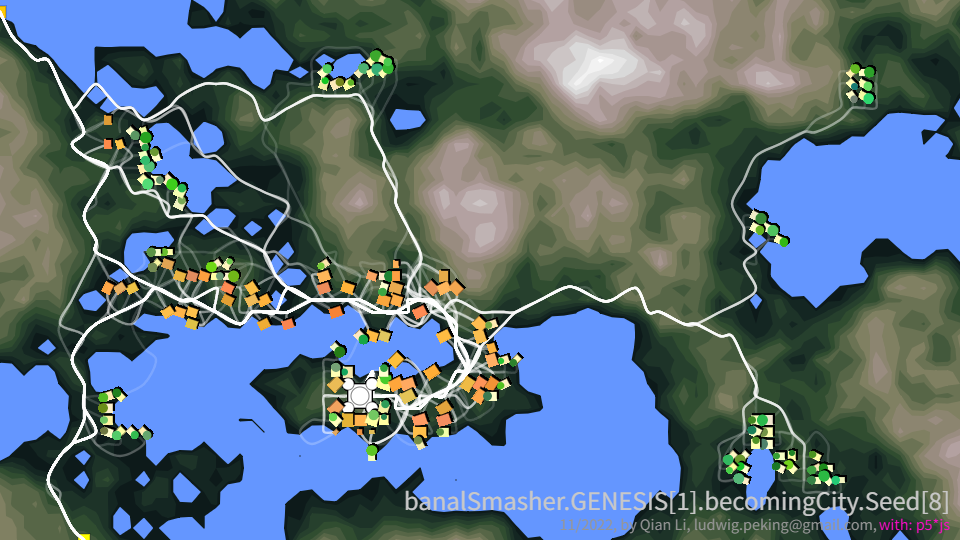

# ICM Blog 2025 Richard_Qian_Li

## Week 2

I tested some ml5 **bodyPose** library. **"MoveNet"** has limited nodes, but works for simple purposes. And this would be an early **interactive attempt** of mine.
HandPose library prompts some error to my browser, which I could not resolve.

I tried to figure out the order of the **p5 transformation** matrices, whose layering was confusing for me for a while. I think I have a bit better grasp on it.

## Week 1

I was writing around a topic that the form of the city traditionally and in a healthy way rises from the accumulative choices made by individuals in their very specific circumstances.

the link to my writings **An Evolutionary History of the City**:  
https://the-book-an-evolutionary-history-of-the-city.vercel.app/?chapter=0&lang=en

The ambition to model the infinitely complicated city in not new. But still many layers of understanding can still be done on it. I have tried to model some of the layers, some are from macro-level, some are from micro-level, I hope they converge later to become a more 

Here I share a **p5 sketch** I did in 2023, which illustrates the process that different classes (Lords, Farmers, Merchants) would value location in an environment in different ways, and a pattern of settlement grows based on their choices of location, and their choices impact the later comers' choices: 
**Becoming City**: 
https://becoming-city.vercel.app/

